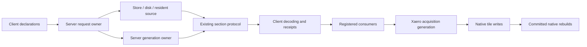

# Current ownership and data flow

LSS receives distant-column declarations, resolves resident/disk/store/generation sources, serializes the existing wire formats and delivers sections to registered consumers. The server owns generation decisions. Receive OFF retires acquisition; it is distinct from disconnecting or replacing a world. Wire compatibility and LSS/VSS cross-brand adoption remain invariant across support tiers.

The Xaero facade delegates lifecycle orchestration to `XaeroSession`. `XaeroBindings` caches external member descriptors; `XaeroAcquisitionQueue` contains acquisition/debt membership; `XaeroTileWriter` owns prepared-tile application; `XaeroRebuildScheduler` holds committed native updates and frame work. The extraction preserves the previous thread topology and lock order. See the implementation ownership matrix for field-level locks, retirement events and receipt owners. OFF must retain committed rebuilds for the same native world. Disconnect/world replacement retires native ownership; old callbacks cannot settle new-session work.

On lines with Folia, a fresh declaration gets one pump tick for an owning-region probe. If that callback is late, disk fallback still proceeds. Each admitted disk attempt retains one bounded opportunity for a loaded probe, including positions beyond the initial 512-position probe window. New declarations, including empty backpressure batches, replace only unadmitted backlog; they do not cancel admitted reads or their corrections. The worker validates the captured result against its registration, dimension, edit epoch, range and exact disk-attempt identity. A corrective body waits until older pending reads and queued bodies for that column have drained, then consumes that exact retained attempt once. An all-air result explicitly clears terrain that the fallback may have installed. Dirty events, retirement, range loss, expiry, rejected or excluded results, and replacement of the admitted attempt discard obsolete work. Retention is capped at 512 attempts and 2 MiB of serialized bodies per player for 10 seconds from the original admission; later declarations do not renew it, and an absent callback does not hold the request open. [Lifecycle](../../common/src/test/java/dev/vox/lss/common/processing/PairedIngressLifecycleTest.java) and [pump/router](../../paper/src/test/java/dev/vox/lss/paper/PaperPumpRouterAlignmentTest.java) tests cover these boundaries.

Corrective frames use the existing wire format. `service.corrective_columns_sent` counts tagged frames only after the sender returns successfully. The soak request-conservation law subtracts that subset of responses because these frames do not consume a new declaration; ordinary send totals remain intact. [Accounting tests](../../common/src/test/java/dev/vox/lss/common/processing/CorrectiveSendAccountingTest.java) cover failed sends, pruning and retirement. On the client, a decoder checks its session epoch again after polling the shared queue. If an old worker has taken a replacement session's receipt, it reports failure through that receipt's captured owner, allowing a retry instead of silently accepting an undelivered column.

Status is an immutable owner-produced read model. UI reads must not initialize request managers, probe optional APIs, read worlds or flush queues. Lifecycle invalidation is immediate even when collection is throttled. Export captures an allowlist before asynchronous filesystem work and never retains live world/manager handles. Server exports are local operator actions; they do not query foreign Folia regions.

`common` is Java 21 without Minecraft dependencies. `xplat` remains a source set compiled by Fabric and NeoForge, with same-FQN loader twins where required. Paper owns its loader-local world/scheduler contracts. `config/compatibility` and `config/lines` document and verify these differences; they do not erase genuine native encoding, mappings, ticket, game-rule or packaging adaptations.
